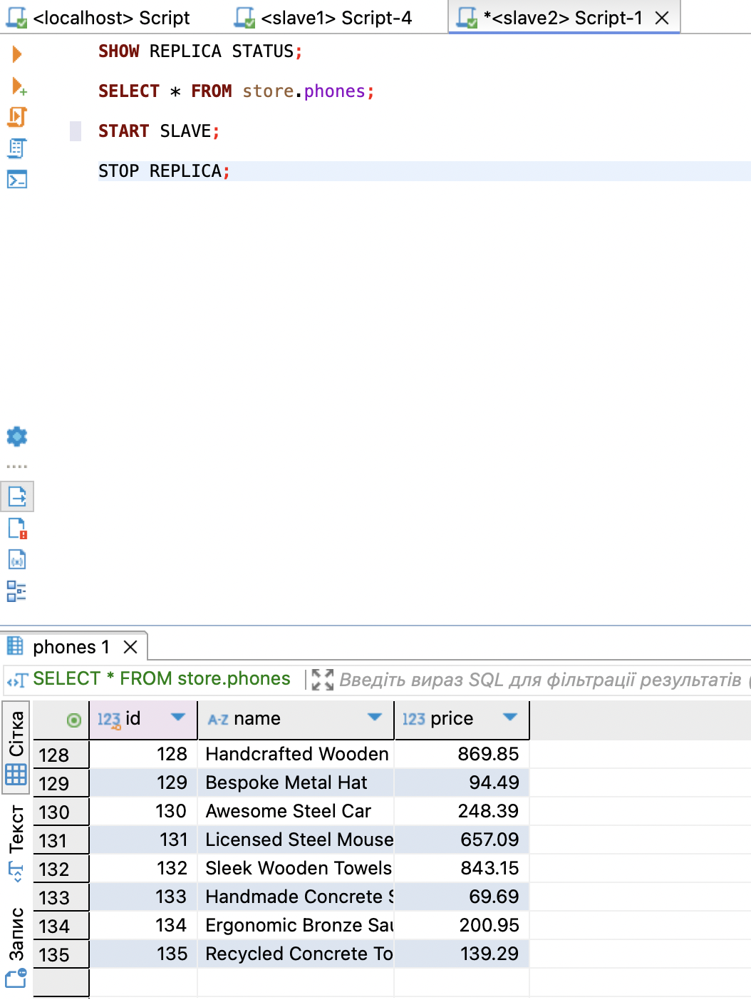
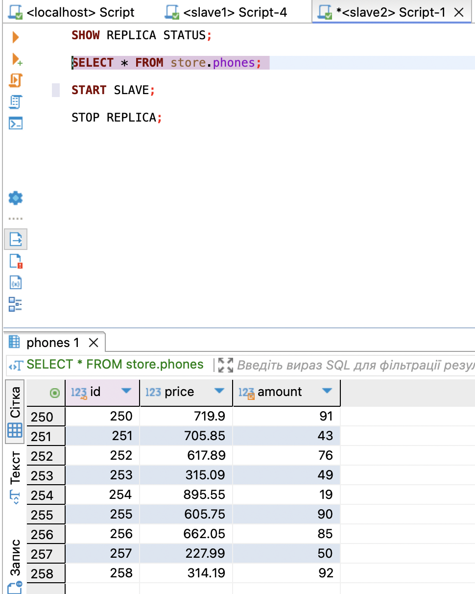

# MySQL Master-Slave replication example

Flow Overview: 
- Create 3 docker containers: mysql-m, mysql-s1, mysql-s2
- Setup master slave replication (Master: mysql-m, Slave: mysql-s1, mysql-s2)
- Write script that will frequently write data to database.
- Ensure, that replication is working.
- Turn off mysql_s2 (stop slave).
- Try to remove a column in  database on slave node (try to delete last column and column from the middle).

## Steps to reproduce replication
1. docker compose up -d --build;
2. npm run db:create-table - create table phones on the master node and prepopulate with initial data;
3. npm run db:master:config - create slave user with permissions;
4. npm run db:slave1:create - create store db on the slave 1 node;
5. npm run db:slave2:create - create store db on the slave 2 node;
6. npm run db:slave1:config - config replication on slave 1 node, start replication and show status 
7. npm run db:slave2:config - config replication on slave 2 node, start replication and show status 
Verify:
```
Slave_IO_Running: Yes
Slave_SQL_Running: Yes
```
8. node insert-sim.js - start inserting rows to master node; 
Verify replication on both slave nodes

## Edge cases - Slave Replication (alter table)
Test how replication works on slaves after altering table - removing last column and middle column; 
1. npm run db:slave2:stop - stop replication;
2. npm run db:slave2:alter - either remove "name" column (middle), or "amount" column (last);
3. START SLAVE; - sql command to start replication after deleting the column;

### Removing last column 
Replication successfully resums without last column; 

Master data 


Slave 2 node data without last column (amount)


As we can see replication works as before but now slave2 node table phones doesn't have amount column

### Removing inner column

Replication doesn't work as expected, after resuming replication. New rows from master doesn't appear on slave2 node. 
Based, on the screenshot below. We can see that last row id remains the same, while master node keeps growing


